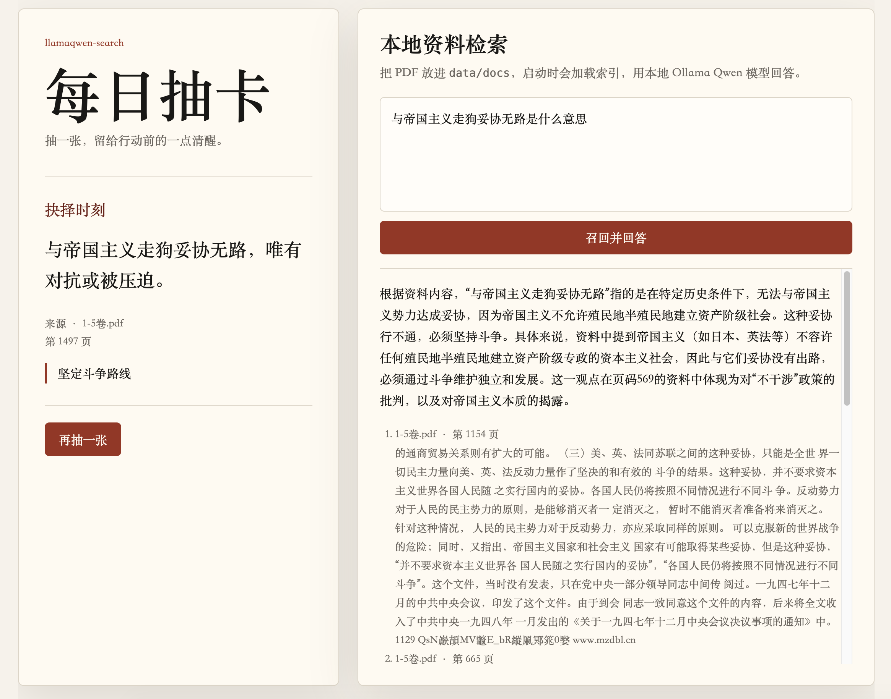

# llamaqwen-search

本地 PDF/文档检索问答 + 每日抽卡。服务启动时会加载 `data/docs` 下的资料，使用 LlamaIndex 做召回，调用本地 Ollama 中的 Qwen 4B 模型生成回答。



## 功能

- 支持把 PDF、Markdown、TXT、DOCX 放到 `data/docs`
- 启动时加载或构建向量索引，索引持久化在 `storage/index`
- 使用 Ollama 本地模型，默认 `qwen3:4b`
- 提供 `/api/ask` 问答接口：混合召回、重排、去重、来源多样性、时间有效性和冲突提示
- 提供 `/api/card/today` 和 `/api/card/draw` 抽卡接口，优先从向量索引随机取依据片段，再用本地 Qwen 提炼成可分享卡片
- 内置一个极简 Web 页面，风格接近每日摘意卡

## 为什么使用 LlamaIndex

这个项目的核心不是单次调用 LLM，而是把本地资料稳定地变成“可检索、可引用、可复用”的知识库。LlamaIndex 在这个场景里比手写向量检索或直接拼 prompt 更合适。

- 文档接入成本低：PDF、Markdown、TXT、DOCX 可以通过统一 Reader 加载，后续扩展网页、数据库、Notion 等数据源也有现成组件。
- 索引链路完整：从文档读取、分块、embedding、向量索引到持久化都有成熟抽象，项目里只需要关心业务流程。
- 召回结果带来源：检索节点会保留 `file_name`、`page_label` 等 metadata，问答和抽卡都能展示文件名、页码和依据片段，避免答案变成无来源的生成文本。
- 本地模型集成直接：`llama-index-llms-ollama` 和 `llama-index-embeddings-ollama` 能同时接入本地 Qwen 和本地 embedding 模型，数据不需要离开本机。
- 方便继续演进：后续如果要换向量库、加 rerank、做混合检索、加多路检索或接入更复杂的 Agent 流程，不需要推翻现有结构。

当前问答链路不是把向量 top-k 直接交给模型，而是先扩大候选召回，再融合向量分数、词法命中、来源权威、时间状态做证据排序。回答前会把证据整理成带编号的证据包，要求模型显式区分当前资料、历史资料、失效资料和版本风险。

简单说，LlamaIndex 负责资料到索引再到候选召回的工程骨架，项目内的证据管线负责生产级聚合和风险控制，Ollama/Qwen 负责本地生成。

## 准备 Ollama

```bash
ollama pull qwen3:4b
ollama pull bge-m3
ollama serve
```

如果你的本地模型名不是 `qwen3:4b`，在 `.env` 里修改 `OLLAMA_MODEL`。如果你希望换召回向量模型，修改 `EMBEDDING_MODEL`。

## 启动

```bash
python3 -m venv .venv
source .venv/bin/activate
pip install -r requirements.txt
cp .env.example .env
uvicorn app.main:app --reload --host 0.0.0.0 --port 8000
```

如果你的终端配置了 SOCKS 代理，`requirements.txt` 已包含 `httpx[socks]`，用于支持 Ollama Python 客户端读取代理环境变量。

打开：

```text
http://localhost:8000
```

## 放入资料

把 PDF 或文本文件放到：

```text
data/docs
```

首次启动会自动构建索引。资料变更后可以删除 `storage/index` 下的索引文件，或设置：

```bash
REBUILD_INDEX=true uvicorn app.main:app --reload --host 0.0.0.0 --port 8000
```

也可以手动重建：

```bash
python scripts/rebuild_index.py
```

### 文档元数据

为了让系统可靠处理多个文件、版本和历史资料，可以给每个文档放一个同名元数据文件：

```text
data/docs/policy.pdf
data/docs/policy.pdf.metadata.json
```

支持字段：

```json
{
  "authority": "official",
  "effective_at": "2024-01-01",
  "expired_at": null,
  "version": "2024.1",
  "tags": ["policy", "finance"]
}
```

`authority` 可用值建议为 `official`、`internal`、`trusted`、`local`、`user`、`archive`。如果没有元数据文件，系统会从文件名推断日期，并把来源按本地资料处理。新增或修改元数据后需要重建索引。

问答时系统会按问题解析时间意图：问“当前/现行/最新”时优先当前有效资料，命中历史或失效资料会降权并提示；问“当时/历史/演变/某一年”时会保留历史资料并按时间解释。

每日抽卡也会读取同一份索引内容：如果索引里有文档片段，服务会先随机选一个片段作为依据，再调用本地 Qwen 生成“标题 + 摘意 + 行动建议”的卡片，并保留文件名和页码。这样页面展示的是提炼后的思考卡，不是随机原文段落。如果还没有资料，会退回到 `data/cards/cards.json` 里的示例卡。

## API

```bash
curl -X POST http://localhost:8000/api/ask \
  -H 'Content-Type: application/json' \
  -d '{"question":"这份资料主要讲了什么？"}'
```

```bash
curl http://localhost:8000/api/card/today
curl -X POST http://localhost:8000/api/card/draw
```

## 配置

| 变量 | 默认值 | 说明 |
| --- | --- | --- |
| `OLLAMA_BASE_URL` | `http://localhost:11434` | Ollama 服务地址 |
| `OLLAMA_MODEL` | `qwen3:4b` | 本地生成模型 |
| `EMBEDDING_MODEL` | `bge-m3` | Ollama 本地向量模型 |
| `DOCS_DIR` | `data/docs` | 文档目录 |
| `INDEX_DIR` | `storage/index` | 索引目录 |
| `CARDS_FILE` | `data/cards/cards.json` | 抽卡内容 |
| `TOP_K` | `4` | 兼容旧配置的基础召回数量 |
| `CANDIDATE_TOP_K` | `30` | 向量候选召回数量，用于重排前扩大候选池 |
| `LEXICAL_TOP_K` | `30` | 关键词候选召回数量，用于补足精确命中 |
| `MAX_EVIDENCE` | `10` | 最终交给模型的证据数量 |
| `REBUILD_INDEX` | `false` | 启动时强制重建索引 |
